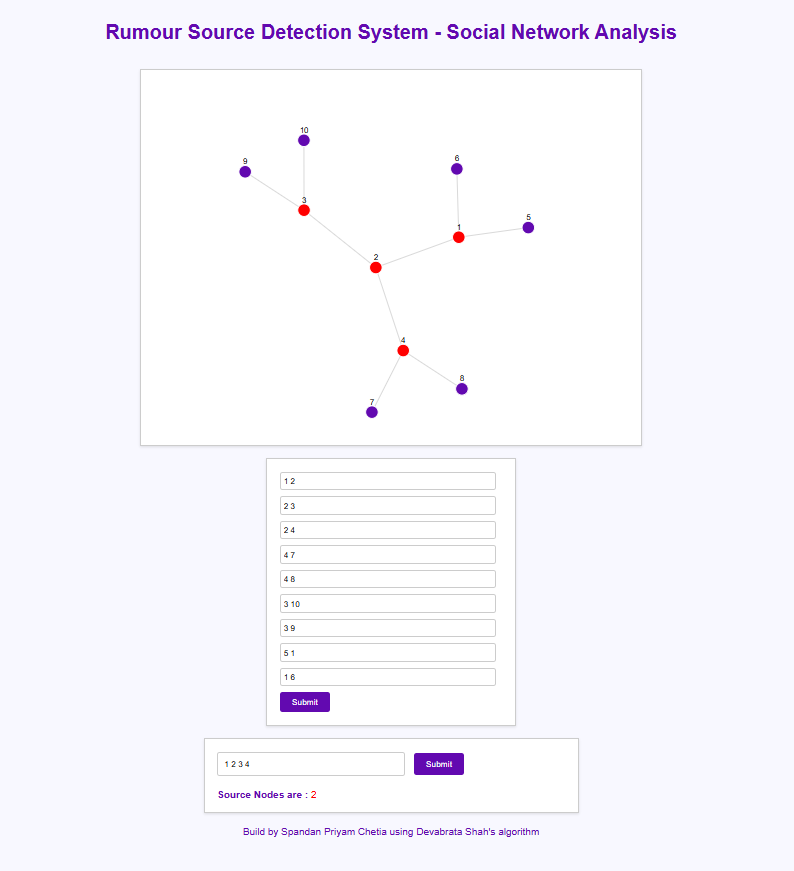
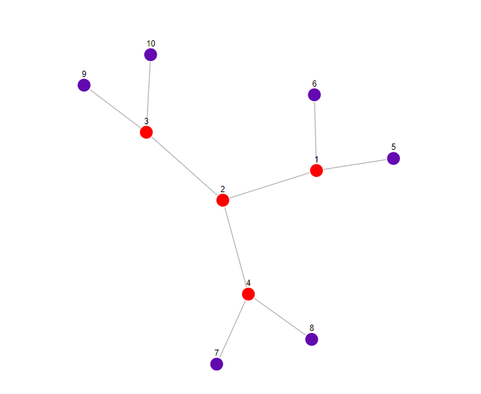

    <h1>Rumor Source Detection Problem</h1>
    
    
Consider a network of nodes modeled as an undirected graph \( G(V,E) \). Suppose the rumor starts at node \( v^* \) at time \( t_0 \) and has spread in the network \( G \). Assume the network is observed at some time \( t_x \) and \( N \) infected nodes are found. By definition, these \( N \) infected nodes must form a connected subgraph of \( G \). Let's denote this subgraph by \( G_N \).
    

    

The goal is to estimate a node \( v \) of the original source \( v^* \) based on the observation. Mathematically,

    \( v = \arg\max_{v \in \mathbb{P}(G)} R(v, G) \) ......(1)

Where \( \mathbb{P}(G \mid v) \) is the probability of observing \( G \) under any information diffusion model assuming \( v \) is the source \( v^* \).

In DevabratShah’s algorithm, equation (1) is further simplified and refined as

    \( v = \arg\max_{v \in R(v, G)} R(v, G) \) ......(2)

Where \( R(v, G) \) is the total number of distinct permitted permutations of nodes of \( G \) that begin with node \( v \in G \) and respect the graph structure of \( G \).

    <h2>Algorithm</h2>

<strong>Permutation:</strong> Given a connected Tree \( G(V,E) \) and source node \( v \in V \), consider any permutation \( \sigma: \{1,2,\ldots, V\} \) of nodes where \( \sigma(a) \) denotes the position of node \( a \in V \) in the permutation \( \sigma \).

<strong>Permitted Permutation:</strong> A permutation \( \sigma \) is referred to as a permitted permutation for \( G(V,E) \) with source node \( v \) if:

<ol>
    <li>Starting node should be \( v \), i.e., \( \sigma_v = 1 \).</li>
    <li>For any edge \( (a, b) \in E \), if \( d(v, a) < d(v, b) \), then \( \sigma(a) < \sigma(b) \).</li>
</ol>

Let \( \Omega(v, G) \) be the set of all permitted permutations starting with node \( v \) and graph \( G \). Therefore, \( \Omega(v, G) = R(v, G) \ ).

To determine the source node, simply find the node \( v \) from \( G \) that maximizes \( R(v, G) \).

    <h2>Example</h2>

<strong>Edges:</strong> (1,2), (2,3), (2,4), (2,1), (3,2), (4,2)

V={1, 2, 3, 4, 5, 6, 7, 8, 9, 10}

Vn={1, 2, 3, 4}

Permutations for v=1
    {1, 2, 3, 4} PP
    {1, 2, 4, 3} PP
    {1, 3, 2, 4} X
    {1, 3, 4, 2} X
    {1, 4, 2, 3} X
    {1, 4, 3, 2} X

Check if permutation {1,2,3,4} is permitted:

    <!-- Example of permitted permutation -->
    For (1,2) edge, \( d(1,1) < d(1,2) \) and \( \sigma(1) < \sigma(2) \) 
    For (2,3) edge, \( d(1,2) < d(1,3) \) and \( \sigma(2) < \sigma(3) \) 
    For (2,4) edge, \( d(1,2) < d(1,4) \) and \( \sigma(2) < \sigma(4) \) 
    For (2,1) edge, \( d(1,2) \not\leq d(1,1) \) 
    For (3,2) edge, \( d(1,3) \not\leq d(1,2) \) 
    For (4,2) edge, \( d(1,4) \not\leq d(1,2) \) 
    Therefore, {1,2,3,4} is a permitted permutation

Repeat similar checks for other permutations starting from node \( v = 1 \), and compute \( R(v, G) \) for \( v = 2, 3, 4 \).

At the end, the source node \( v \) with the highest \( R(v, G) \) value is considered as the estimated rumor source.

